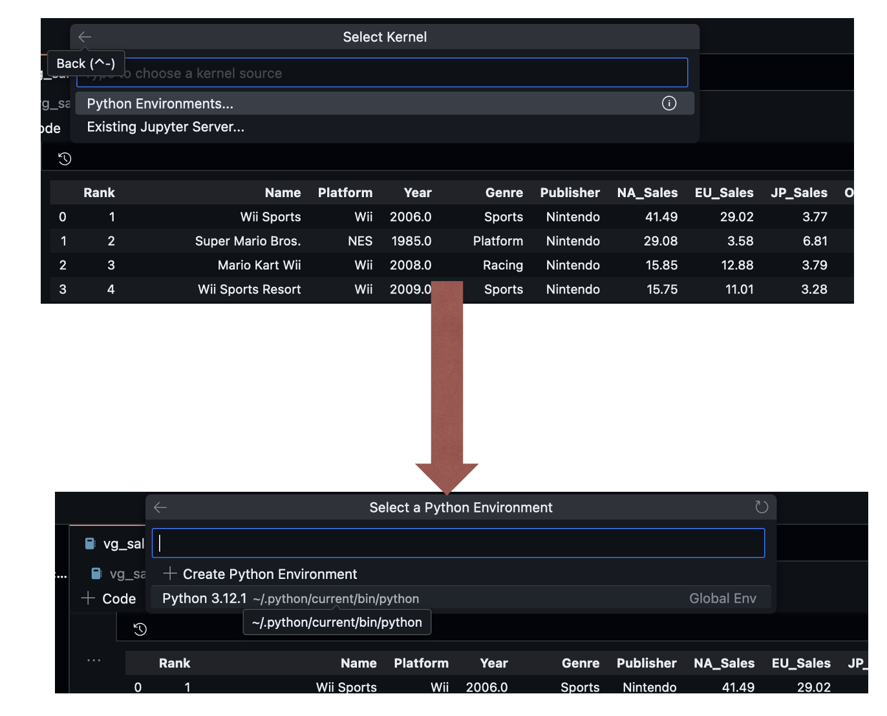
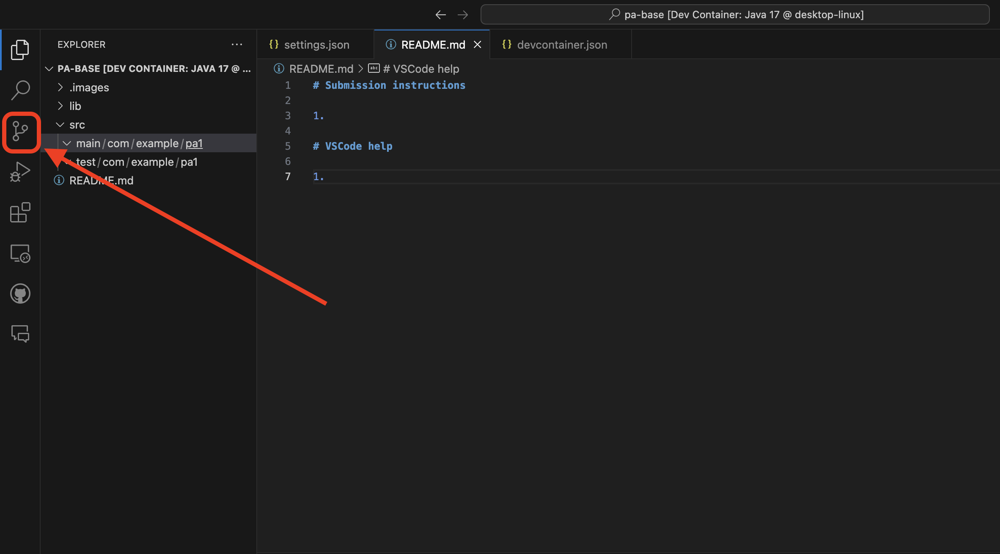
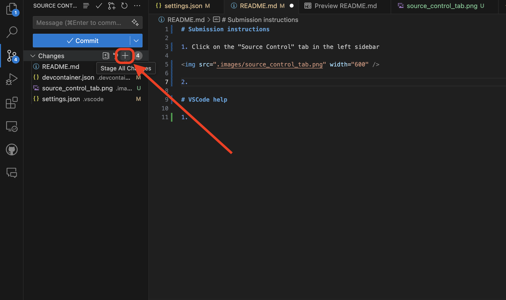
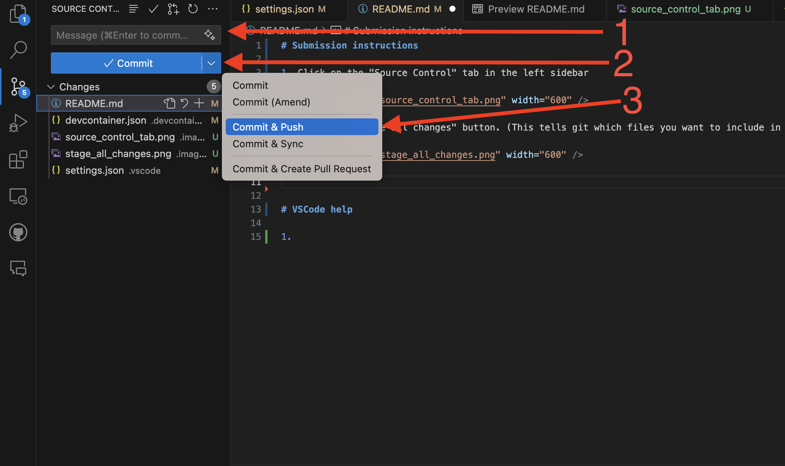

# HW3: Distributions, Four Ways

In this homework, you will be using four different methods for generating a visualization of the same data: one point-and-click tool (Tableau) and three Python libraries (`matplotlib`, `seaborn`, and `altair`).  The goal of this assignment is for you to be exposed to a variety of visualization libraries and understand the strengths and weaknesses between them.  

You will start by exploring the data in Tableau to get a feel for it. Then you will use multiple python libraries to try to recreate the same chart type, with some small modifications.  You will be asked to read the documentation for the libraries we are using, and you will be graded based on your ability to find the right configuration options to complete various modifications of the chart.

You will submit a link to your repository and a PDF containing notes and screenshots from various parts of the assignment.  

## Getting started: make your own copy of this repository

Before you do anything else, make your own private copy of this repository inside the course organization. **Don't fork it and don't work directly in this repository.** You'll do all of your work, and we'll grade it, in your own copy.

1. **Join the course organization (one time only).** You should have received an email invitation to join the **`COSI116A-Brandeis-Infovis`** organization on GitHub. Accept it, or go to `https://github.com/orgs/COSI116A-Brandeis-Infovis/invitation` while signed in. Invitations expire after 7 days, so ask our TA Derrick for a new one if yours has expired. You can't do the next steps until you've joined.
2. At the top of this repository's page, click the green **Use this template** button and choose **Create a new repository**.
3. Fill in the form:
   - **Owner:** choose **`COSI116A-Brandeis-Infovis`**, *not* your personal account. ⚠️ If the organization isn't in the list, you haven't accepted the invitation from step 1 yet.
   - **Repository name:** `assignment3-distributions-YOUR_GITHUB_USERNAME` (for example, `assignment3-distributions-jane-doe`).
   - **Visibility:** choose **Private**. ⚠️ This keeps your work hidden from other students.
   - Leave **Include all branches** unchecked.
4. Click **Create repository**.
5. Check that your new repository's URL looks like `https://github.com/COSI116A-Brandeis-Infovis/assignment3-distributions-YOUR_GITHUB_USERNAME` and that it shows a **Private** label next to its name.

That's the repository you'll work in for the rest of the assignment, and it's the link you'll submit on Moodle. Course staff can see it automatically because it's in the course organization, so you don't need to add anyone as a collaborator. For more detail, see the course's GitHub guide on Moodle.

## Dataset: Video Game Sales

In this homework, we are working with a dataset showing Video Game sales.  We will be building a chart that analyzes the relationship between North American and foreign sales, along with some ancillary variables like publisher, genre, year, and platform.  

The dataset was gathered from a [kaggle.com competition](https://www.kaggle.com/datasets/gregorut/videogamesales). It covers about 16,600 games that sold at least 100,000 copies, and it was collected around 2016, so the most recent years are incomplete.

| Column | Meaning |
| --- | --- |
| `Rank` | Rank of the game by global sales (an ID, not something to add up) |
| `Name` | Title of the game |
| `Platform` | Console or system the game was released on (Wii, PS2, DS, ...) |
| `Year` | Year of release (`N/A` for a few hundred games) |
| `Genre` | Genre of the game (Action, Sports, Role-Playing, ...) |
| `Publisher` | Company that published the game |
| `NA_Sales`, `EU_Sales`, `JP_Sales`, `Other_Sales` | Sales in North America, Europe, Japan, and the rest of the world, **in millions of copies** |
| `Global_Sales` | Total worldwide sales, in millions of copies |

## Part 0: Exploring the data in Tableau

Before writing any code, you will explore the dataset in Tableau Desktop, the tool you used in the Tableau tutorial. The goal is to get familiar with the data and practice turning a view into an insight. This part should take about an hour.

### Getting Tableau

If you don't already have it installed, students can get a free Tableau Desktop license through the [Tableau for Students](https://www.tableau.com/academic/students) program. 

### Step 1: Download the data

The dataset is already in this repository at `data/vgsales.csv`. To get a copy on your computer:

1. Go to your repository on github.com and click on the `data` folder, then on `vgsales.csv`.
2. Click the **Download raw file** button (the download icon near the top right of the file view) and save the file somewhere you can find it.

If you have cloned your repository onto your computer, the file is already there. Don't open and re-save the file in Excel before loading it, since Excel can quietly change the formatting of some columns.

### Step 2: Load the data into Tableau

1. Open Tableau. In the **Connect** pane on the left, under **To a File**, click **Text file** and select `vgsales.csv`.
2. You will land on the **Data Source** page with a preview of the table. Check that Tableau picked sensible data types (the small icon above each column name):
   - The five sales columns should be numbers (`#`).
   - `Year` may come in as text (`Abc`) because some rows contain `N/A`. If so, click the icon and change it to **Number (whole)**. The `N/A` rows will become null, which is fine.
3. Click the **Sheet 1** tab at the bottom to start building a view.
4. In the **Data** pane, `Year` and `Rank` will probably be listed as measures. Right-click `Year` and choose **Convert to Dimension**, so that Tableau treats each year as a point in time instead of adding the years together. You won't need `Rank`.

### Step 3: Build views and write down what you find

Create each of the views below on its own worksheet (right-click a sheet tab and choose **New Worksheet**, or **Duplicate** to start from a previous one). For each view:

- **Take a screenshot** of the finished view, including its legend. You can use **Worksheet > Export > Image...** in Tableau or a regular screenshot.
- In your writeup document, paste the screenshot and **write 2-4 sentences explaining what insights you see**: the main pattern, anything surprising, and any reason to be cautious about the data behind the view.
- Give every view a descriptive title (double-click the sheet title to edit it).

**View 1: Which genres sell the most?**
Put `Genre` on **Rows** and `Global_Sales` on **Columns** to make a horizontal bar chart of total sales by genre. Sort it from highest to lowest. Then make a second version that shows the *number of games* in each genre instead of total sales: drag `Name` to **Columns**, click its dropdown, and choose **Measure > Count**. *Are there genres with lots of games but relatively low sales, or the other way around? What might explain that?*

**View 2: How have sales changed over time, and where?**
Make a line chart with `Year` on **Columns** and `Global_Sales` on **Rows**. Then split sales by region: drag **Measure Values** to **Rows** in place of `Global_Sales`, and drag **Measure Names** to **Color**. On the **Measure Values** card, remove everything except `NA_Sales`, `EU_Sales`, `JP_Sales`, and `Other_Sales`. *When did the market peak? Has the balance between regions changed over time? What happens in the last few years of the data, and do you think that reflects the real market?*

**View 3: Do different regions like different genres?**
Build a highlight table: `Genre` on **Rows**, **Measure Names** on **Columns** (filtered to the four regional sales columns as in View 2), and **Measure Values** on both **Color** and **Text/Label**. Raw totals are dominated by the biggest market, so convert to percentages: click the dropdown on **Measure Values** on the Marks card, choose **Quick Table Calculation > Percent of Total**, then **Compute Using > Table (down)**. Now each column shows how a region's sales are split across genres. *Which genres are relatively more popular in Japan than in North America or Europe, and vice versa? Why would looking at raw totals here have been misleading?*

**View 4: Platform lifecycles.**
Make a line chart with `Year` on **Columns**, `Global_Sales` on **Rows**, and `Platform` on **Color**. With over 30 platforms this is unreadable, so drag `Platform` to **Filters**, go to the **Top** tab, and keep the top 8 platforms by `Global_Sales`. *How long does a typical platform stay popular? Do you see generations of consoles replacing each other? Are there any platforms that don't follow the usual pattern?*

**View 5: North American vs. Japanese sales for individual games.**
This view previews the chart you will build in Python in the rest of the assignment. Put `NA_Sales` on **Columns** and `JP_Sales` on **Rows**. By default Tableau adds everything into a single point, so go to the **Analysis** menu and uncheck **Aggregate Measures** to get one point per game. Put `Genre` on **Color** and `Name` on **Tooltip**, then open the **Analytics** pane and drag a **Trend Line** onto the view. Hover over the points that stand out. *Are games that sell well in North America also big hits in Japan? Which games are outliers, and does genre help explain them?*

**View 6: Your own question.**
Come up with your own question about the data and build a view that answers it. Some ideas: which publishers dominate the market and whether they specialize in certain genres, how a single publisher or franchise has done over time, or how handheld and home consoles compare. In your writeup, state the question, explain why you chose that chart type, and describe what you found.

### What to submit for Part 0

Save your writeup (screenshots plus explanations for all six views) as a Google doc (or Word doc). You don't need to submit your Tableau workbook. 

## Parts 1-3: Running the notebook

Development for this assignment is done inside of a [Jupyter Notebook](https://jupyter.org/), a common tool for iterative data science work.  There are several ways that you can run this notebook and develop your homework.  Notebooks like this are composed of a sequence of "cells", with each cell containing some snippets of code or some descriptive, README-like text.  When you run a cell in your notebook, it saves the result of that cell in memory.  To run a cell, you can either click the little "play" button on the top right corner of a cell, or you can use Shift+Enter to run the current cell.

Note that these python cells run against a python server, different than the web server we have been using in class.  There are two methods you can use to run your notebook server.

### Method 1: Github codespaces

The first and easiest way to run the notebook in this assignment is to run it in [Github Codespaces](https://github.com/features/codespaces), a cloud-based development environment that runs VS Code in your browser.  This repository includes a configuration file (`.devcontainer/devcontainer.json`) that sets up Python and installs all of the packages the notebook needs, so you don't have to install anything yourself.

To open a codespace:

1. Go to **your** repository on github.com (the one you created for this assignment, not the original template).
2. Click the green **Code** button (where you usually find your `.git` URL), switch to the **Codespaces** tab, and click **Create codespace on main**.
3. The first launch takes a few minutes. Wait until the setup finishes (you'll see the progress in the terminal at the bottom) before running any cells, or the notebook may complain that packages like `seaborn` or `altair` are missing.

When you come back later, reopen your **existing** codespace from the same **Code > Codespaces** menu instead of creating a new one. Any work you haven't committed and pushed only exists inside that codespace.

Codespaces is free up to a monthly limit on your personal GitHub account (currently 120 hours per month on the default machine for free accounts, and more with the [GitHub Student Developer Pack](https://education.github.com/pack)). This assignment uses far less than that, but to avoid wasting your hours, stop your codespace when you are done working (**Code > Codespaces > ... > Stop codespace**) and delete it once your assignment is submitted. Codespaces also stop by themselves after 30 minutes of inactivity.

There are 2 important things to note when using github codespaces.

1. When you run the python notebook for the first time, you will have to select what jupyter server to run against.  You want to select the local version of python we have running in the codespaces.  See the screenshot below.

2. When you are using codespaces, your code won't actually get pushed to us automatically.  Like with your earlier HW 1, you will have to create a git commit and push it.  From codespaces, you do this in the following way. 

Expand to see instructions

1. Click on the "Source Control" tab in the left sidebar

2. Click the "Stage all changes" button. (This tells git which files you want to include in the next commit.)

3. Enter a "commit message". Normally this message would describe the changes you made to the code, but for our projects you can enter anything (but it can't be empty).   **You need to remember to make a commit message!**  If you click the commit button without creating a commit message, it will open a file called something like EDIT_MSG, and it will not push your code and may cause your VS Code to freeze until you close the EDIT_MSG tab.  

Then, click the dropdown on the "Commit" button and select "Commit & Push".

 

### Method 2: Running locally against your own Jupyter installation

If you are comfortable using jupyter on your own, or managing your own python environment, you can run jupyter yourself in a terminal on your machine.  You can follow the instructions here to figure out how to install jupyter, and then run `jupyter notebook` in your terminal.  Note that there is a `requirements.txt` file that says what python packages you need to install for this assignment.  Again, remember to commit and push your changes.

If you use your own machine to work on your notebook, you should then be creating your own git commit and pushing it using the terminal, like you did with HW 1.  This typically means first saving your work, then in your file explorer, finding the folder you have been working in, right clicking and opening the terminal or gitbash there, and then running your git commands:

    git add .
    git commit -m "MY COMMIT MESSAGE HERE"
    git push

Then, you should go to your repository page on github.com to confirm that it pushed.

If you run into any issues or you want us to know anything about your work, you can add a section to your writeup document.

When you are finished, make sure that your commits have gone through, and that your repository contains your completed notebook.  If you have any issues, please go to a TA.  Lastly, **remember to submit the link to your URL and a PDF of your writeup on the Moodle assignment**.
